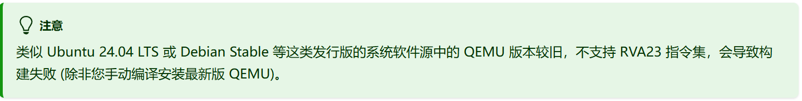
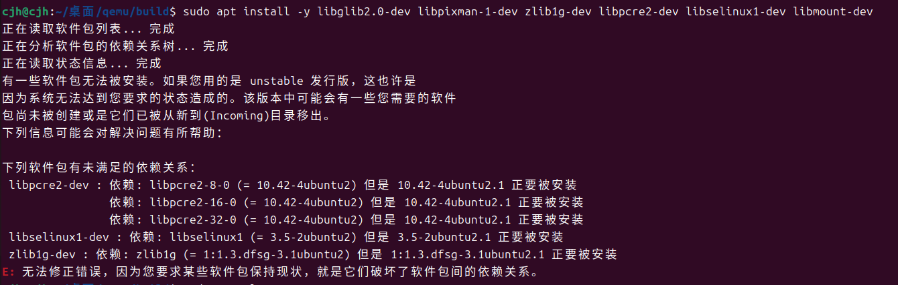
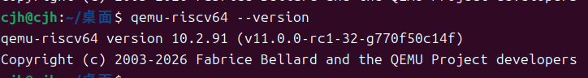
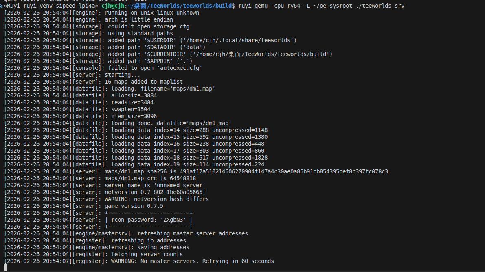
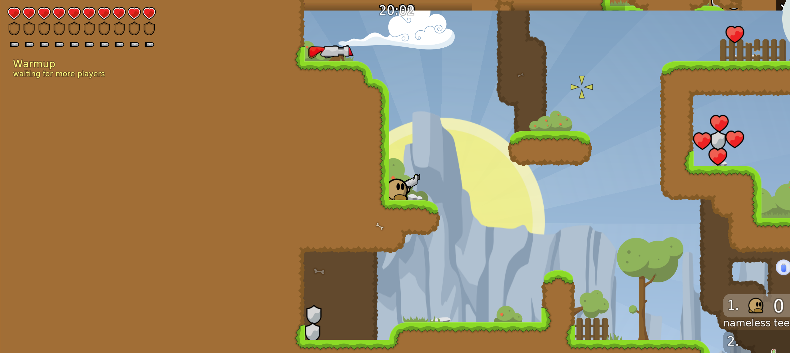

### 本文档详细介绍了如何借用OpenRuyi操作系统的sysroot与RuyiSDK进行交叉编译teeworlds
不知道小伙伴有没有听说过最近发生的一件大事，OpenRuyi操作系统正式上线！今天我们来试一试OpenRuyi和RuyiSDK能不能擦出不一样的火花吧
## OpenRuyi rootfs
OpenRuyi官方网址
```bash
https://openruyi.cn/zh-Hans/
```
### 安装OpenRuyi rootfs
```bash
$ wget https://releases.openruyi.cn/creek/2026.03/rva23/openRuyi-2026.03-rootfs-oci.tar.zst
```
## Qemu


因为 ubuntu 24.04 LTS 的软件源中的qemu版本过低，无法支持RVA23指令集，因此我们需要手动编译较高版本的qemu模拟器

### 依赖补充

```bash
sudo apt update
sudo aptitude install
sudo aptitude install  pkg-config ninja-build libglib2.0-dev libpixman-1-dev zlib1g-dev libpcre2-dev libselinux1-dev libmount-dev
```

### 手动编译Qemu
```bash
$ git clone https://github.com/qemu/qemu.git
$ cd qemu
$ mkdir build && cd build
$ ../configure --static --prefix=/usr/local --target-list=riscv64-linux-user
$ make -j$(nproc)
$ sudo make install
```
### Qemu版本
```bash
$ qemu-riscv64 --version
```

### Qemu配置
因为 openRuyi 可能直接调用 /usr/bin/qemu-riscv64（系统自带的旧版路径），而本文将新版本Qemu装在 /usr/local/bin/,需要做一些调整：

```bash
# 设置软连接
$ sudo ln -sf /usr/local/bin/qemu-riscv64 /usr/bin/qemu-riscv64
# 注销那个原qemu的旧规则
$ echo -1 | sudo tee /proc/sys/fs/binfmt_misc/qemu-riscv64
# 注册 RISC-V 解释器规则
$          echo':qemu-riscv64:M::\x7f\x45\x4c\x46\x02\x01\x01\x00\x00\x00\x00\x00\x00\x00\x00\x00\x02\x00\xf3\x00:\xff\xff\xff\xff\xff\xff\xff\x00\xff\xff\xff\xff\xff\xff\xff\xff\xfe\xff\xff\xff:/usr/local/bin/qemu-riscv64:POCF' | sudo tee /proc/sys/fs/binfmt_misc/register
$ cat /proc/sys/fs/binfmt_misc/qemu-riscv64
```
## sysroot配置
```bash
sudo chroot ~/openruyi-rootfs /bin/bash
```
### 依赖补充
```bash
$ dnf install -y SDL2-devel SDL2-static freetype-devel libpng-devel wavpack-devel  libX11-devel zlib-devel openssl-devel libXext-devel libXcursor-devel libXinerama-devel libXi-devel libglvnd-devel mesa-gl  libepoxy mesa-dril-devel.noarch
  
```
## 编译游戏
```bash
$ git clone --recursive https://github.com/teeworlds/teeworlds.git
```
## 运用RuyiSDK 虚拟环境交叉编译
### 安装并激活 Ruyi 虚拟环境

### 在源码toolchains目录创建 toolchain.cmake
```bash
set(CMAKE_SYSTEM_NAME Linux)
set(CMAKE_SYSTEM_PROCESSOR riscv64)

set(CMAKE_C_COMPILER "riscv64-plctxthead-linux-gnu-gcc")
set(CMAKE_CXX_COMPILER "riscv64-plctxthead-linux-gnu-g++")

set(CMAKE_SYSROOT "/home/cjh/openRuyi")

set(CMAKE_FIND_ROOT_PATH "/home/cjh/openRuyi")
set(CMAKE_FIND_ROOT_PATH_MODE_PROGRAM NEVER)
set(CMAKE_FIND_ROOT_PATH_MODE_LIBRARY ONLY)
set(CMAKE_FIND_ROOT_PATH_MODE_INCLUDE ONLY)
set(CMAKE_FIND_ROOT_PATH_MODE_PACKAGE ONLY)
set(CMAKE_INCLUDE_PATH "/home/cjh/openRuyi/usr/include/freetype2")
set(FREETYPE_LIBRARY "/home/cjh/openRuyi/usr/lib64/libfreetype.so")

# OpenGL library configuration
set(OPENGL_INCLUDE_DIR "/home/cjh/openRuyi/usr/include")
set(OPENGL_opengl_LIBRARY "/home/cjh/openRuyi/usr/lib64/libGL.so")
set(OPENGL_gl_LIBRARY "/home/cjh/openRuyi/usr/lib64/libGL.so")
```
### 交叉编译
```bash
$ mkdir build && cd build
$ cmake .. -DCMAKE_TOOLCHAIN_FILE=../toolchain.cmake
$ make -j4
$ make install
```

### 启动服务器
```bash
$ ruyi-qemu -cpu rv64 -L ~/oe-sysroot ./teeworlds_srv
```



### 启动客户端
```bash
$ xhost +local:
$ DISPLAY=$DISPLAY LIBGL_ALWAYS_SOFTWARE=1 ruyi-qemu -cpu rv64 -L ~/oe-sysroot ./teeworlds
```




