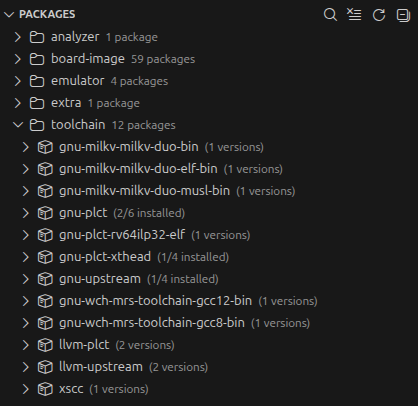
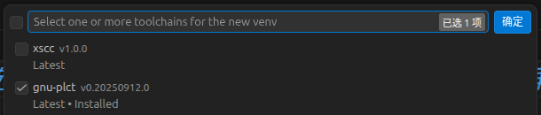
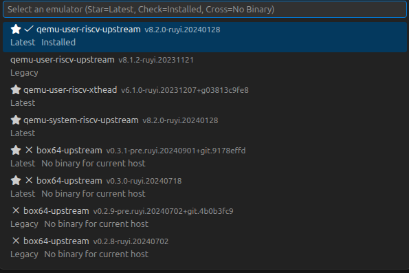
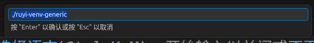
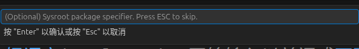
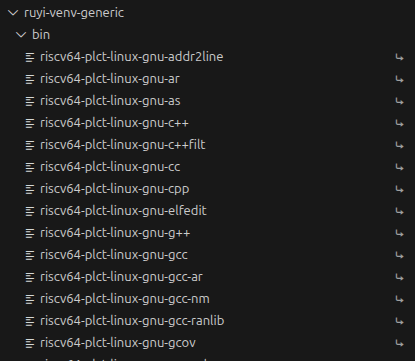
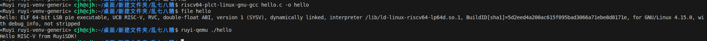

# 从零开始的RuyiSDK之旅
对于想要入门RISC-V开发的小伙伴来说，没有硬件开发板往往是第一个拦路虎。购买开发板需要成本，等待物流又耗费时间，有没有办法直接在普通电脑上完成RISC-V程序的编写、编译与运行？
今天就给大家带来超详细的教程，无需任何RISC-V开发板，借助VSCode插件搭配ruyi-qemu模拟器，就能在Linux等系统上，搭建一套完整的RISC-V开发环境，轻松运行你的第一个RISC-V程序。
## RuyiSDK与Ruyi包管理器
RuyiSDK是面向RISC-V 架构的一站式、全功能开源开发环境，旨在为 RISC-V 开发者帮开发者快速搭建 RISC-V 开发、编译、调试、仿真与部署环境。Ruyi 是 RuyiSDK 的专用包管理器，可一键安装、管理交叉编译工具链、模拟器、系统镜像等开发资源
## Ruyi包管理器的安装
ruyi包管理目前发布在[Github](https://github.com/ruyisdk/ruyi/releases/)和[ISCAS镜像源](https://fast-mirror.isrc.ac.cn/ruyisdk/ruyi/releases/),目前为 Linux 系统预编译了 amd64(即x86_64)、arm64、riscv64 三种架构的二进制，目前主流的安装方式是使用这些预编译的二进制进行安装：
```bash
# 这里以 x86架构 的0.47版本为例,
$ wget https://mirror.iscas.ac.cn/ruyisdk/ruyi/tags/0.47.0/ruyi-0.47.0.amd64
# 赋予权限
$ chmod +x ./ruyi-0.47.0.amd64
# 将 Ruyi 包管理器安装到系统路径中，以便你在随时随地都能直接通过输入 ruyi 来使用它
$ sudo cp -v ./ruyi-0.47.0.amd64 /usr/local/bin/ruyi
```
## RuyiSDK-VScode-extension
RuyiSDK 的官方 VS Code 扩展，用于在 VS Code 中集成 RuyiSDK 包管理器、工具链、虚拟环境与开发板支持，可实现代码编写、一键编译、模拟器启动、调试等全流程可视化操作，告别纯命令行的繁琐
### RuyiSDK-VScode-extension的安装
RuyiSDK-VScode-extension已上线Vscode MarketPlace搜索 RuyiSDK、Ruyi RISC-V等即可直接安装。
离线安装：从 github[官方仓库](https://github.com/ruyisdk/ruyisdk-vscode-extension/releases)中下载最新 ，在 VS Code 中选择 “从 VSIX 安装”。

### 包管理可视化界面
我们在自己的电脑上进行 RISC‑V 开发时，我们无法直接使用原生工具链编译、运行面向 RISC‑V 指令集的程序 —— 这正是 RuyiSDK 中各类工具包存在的核心意义。



toolchain集成了RISC-V的工具链，在x86等架构实现了交叉编译，将代码转换为 RISC‑V 架构可识别的指令
```bash
#安装最新的 GNU 上游工具链。
$ ruyi install gnu-upstream
```

emulator 让开发者在无硬件时，通过 QEMU 等工具虚拟出 RISC‑V 运行环境，快速验证程序逻辑

board-image 则为 Milk-V、LicheePi 等开发板提供预编译系统镜像，简化固件烧录与系统部署流程；analyzer 与 extra 进一步补足了动态调试、性能分析与辅助开发能力，共同构成一套完整的 RISC‑V 开发闭环，让开发者能高效、低成本地完成从代码编写到硬件部署的全流程工作。
```bash
$ ruyi device provision
```


### 虚拟环境
同时，RuyiSDK 还提供了独立的虚拟环境管理功能，可以为不同项目、不同开发板创建相互隔离的环境，每个环境可独立绑定专属的工具链、依赖与配置，避免多项目之间版本冲突，让复杂的 RISC‑V 开发环境更加整洁、可复现。






然后一路回车即可顺利创建虚拟环境，创建的虚拟环境可以通过package下方的venv激活以及关闭






在创建的licheepi4A虚拟环境中，你可以在ruyi-venv-sipeed-lpi4a/bin目录下看见RISC-V架构的工具链了



那现在趁热打铁试试看自己编译一个Hello world文件，将其编译为RISC-V的文件吧
```bash
#include<stdio.h>
int main() {
    printf("Hello RISC-V from RuyiSDK!\n");
    return 0;
}
```
在开启虚拟环境后，使用RISC-V工具链即可将c语言程序编译为RISC-V架构，并用ruyi-qemu成功运行

初级阶段  
参考2048 俄罗斯方块等小游戏，在终端中即可运行
中级阶段  
参考teeworlds blog（游戏需要依赖极少）  
进阶阶段  
参考supertux blog  


