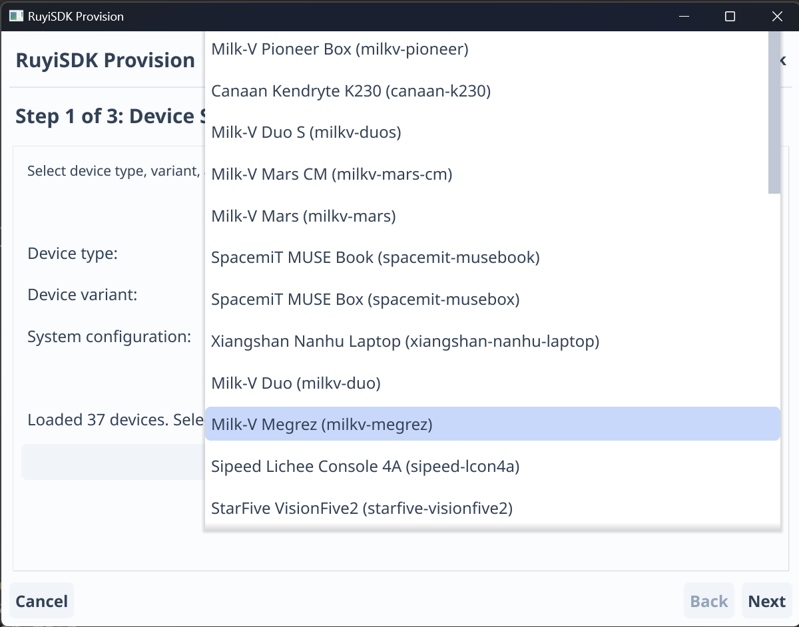
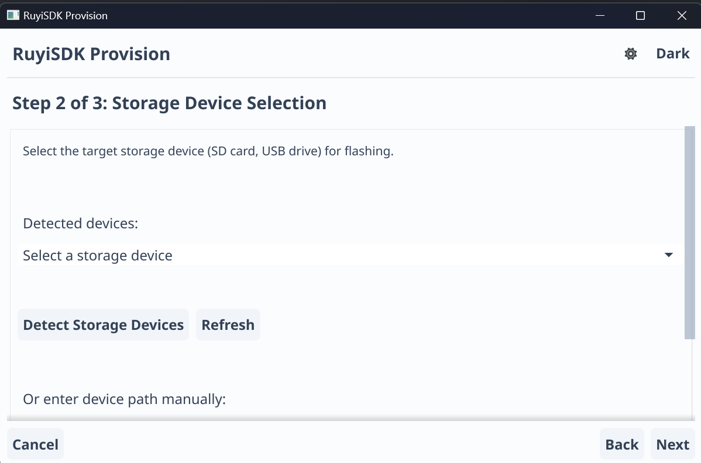

## Ruyi GUI Provision

将 ruyi 的 provision 命令流程整合到 ruyi-gui 风格的 Fyne GUI 中，提供 Windows 环境下设备烧录向导。

### 功能特性

- USB 烧录和检测功能由 [usb_detect](https://github.com/ruyisdk-test/usb_detect) 实现
- 自动从 [ruyisdk/packages-index](https://github.com/ruyisdk/packages-index) 获取镜像列表

### 使用流程

#### 1. 选择镜像

用户选择镜像后，点击下一步，系统自动检测 USB 设备。

#### 2. 选择 USB 设备

系统自动检测并列出可用的 USB 设备供用户选择。

#### 3. 下载并写入镜像

选择 USB 设备后，系统自动下载镜像并直接写入设备。

### 项目链接

- [GitHub 仓库](https://github.com/ruyisdk-test/ruyi_provision_gui)

### 下一步计划

1. 优化 GUI 界面风格
2. 对不同开发板镜像写入做测试，检查镜像写入的正确性
