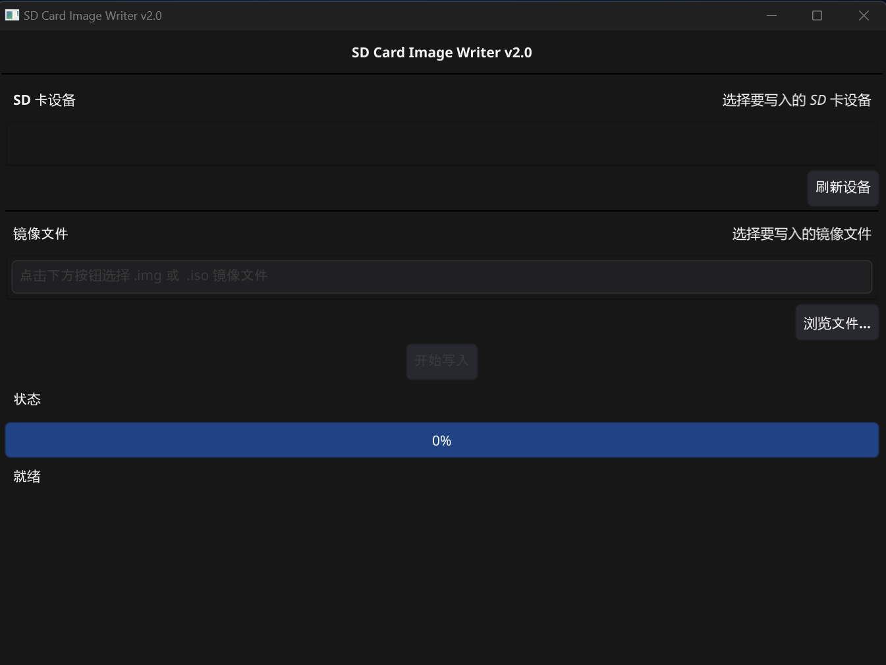

## USB Detect

基于 Windows PowerShell 的 USB 设备 dd 命令工具。

### 功能介绍
支持 GUI 和 CLI 两种方式，作为实现 Ruyi provision GUI 界面的 Windows 版本功能基础

支持识别 USB 设备，选择镜像写入的基础功能。

### 项目仓库
[仓库链接](https://github.com/21758/usb_detect)

### 界面展示

