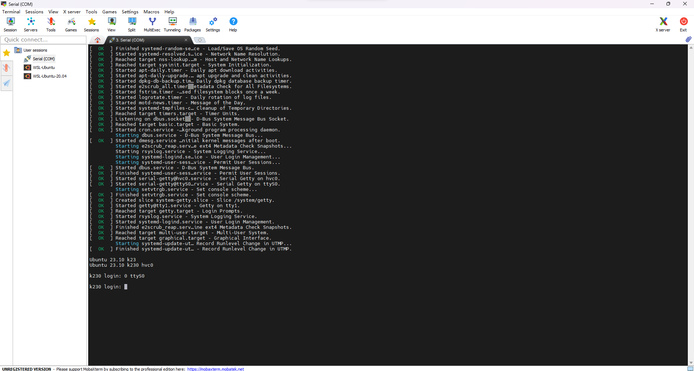
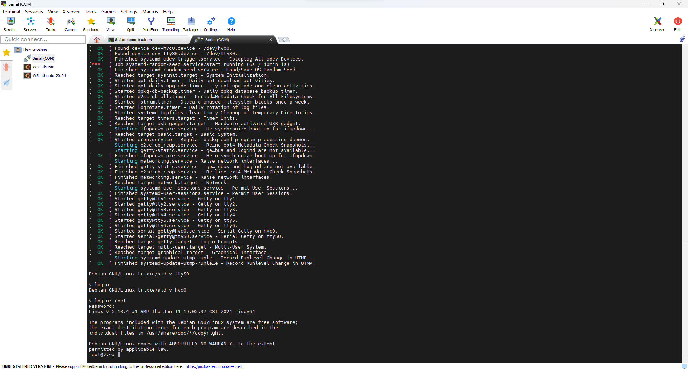
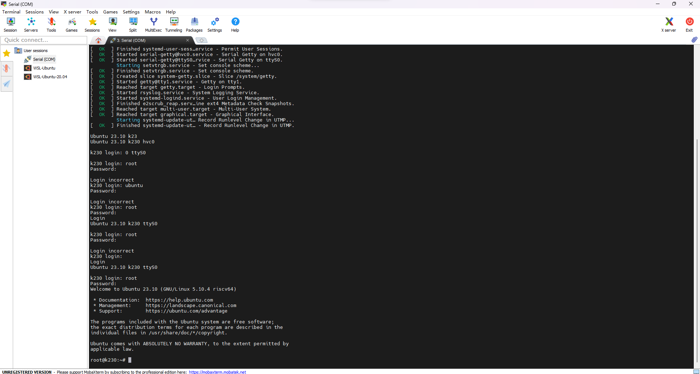

# CanMV-K230 镜像烧写

## CanMV-K230 镜像下载地址

镜像从 <https://developer.canaan-creative.com/resource> 下载。

+ Ubuntu 23.10 <https://kendryte-download.canaan-creative.com/developer/k230/canmv_ubuntu_sdcard_1.3.img.gz>
+ Debian sid <https://kendryte-download.canaan-creative.com/developer/k230/canmv_debian_sdcard_sdk_1.3.img.gz>

下载 CanMV-K230\_micropython 开头的 gunzip 压缩包，解压即为 CanMV-K230 的固件。

## 镜像烧录

以 Debian 为例将镜像从电脑烧写至 Micro SD 卡中，假设 Micro SD 卡设备为 ``/dev/sdb`` 。

```bash
$ wget https://kendryte-download.canaan-creative.com/developer/k230/canmv_debian_sdcard_sdk_1.3.img.gz
$ gunzip -d canmv_debian_sdcard_sdk_1.3.img.gz
$ sudo dd if=canmv_debian_sdcard_sdk_1.3.img of=/dev/sdb bs=1M status=progress oflag=sync
```




默认 root 密码为 root 。





## micropython

镜像从 <https://developer.canaan-creative.com/resource> 或 <https://github.com/kendryte/k230_canmv/releases> 下载。

+ micropython 镜像 v0.1 GitHub <https://github.com/kendryte/k230_canmv/releases/download/v0.1/CanMV-K230_micropython_v0.1_sdk_v1.0.1_nncase_v2.3.0.img.gz>
+ micropython 镜像 v0.2 GitHub <https://github.com/kendryte/k230_canmv/releases/download/v0.2/CanMV-K230_micropython_v0.2_sdk_v1.1_nncase_v2.4.0.img.gz>
+ micropython 镜像 v0.2 <https://kendryte-download.canaan-creative.com/developer/k230/CanMV-K230_micropython_v0.2_sdk_v1.1_nncase_v2.4.0.img.gz>
+ micropython 镜像 v0.3 <https://kendryte-download.canaan-creative.com/developer/k230/CanMV-K230_micropython_v0.3_sdk_v1.1_nncase_v2.4.0.img.gz>
+ micropython 镜像 v0.4 <https://kendryte-download.canaan-creative.com/developer/k230/CanMV-K230_micropython_v0.4_sdk_v1.3_nncase_v2.7.0.img.gz>

## 外部链接

+ [Welcome to K230 CanMV’s documentation!](https://developer.canaan-creative.com/k230_canmv/dev/index.html)
+ [K230\_CanMV使用说明](https://developer.canaan-creative.com/k230_canmv/dev/zh/userguide/K230_CanMV%E4%BD%BF%E7%94%A8%E8%AF%B4%E6%98%8E.html)
+ [K230 SDK使用说明](https://developer.canaan-creative.com/k230/dev/zh/01_software/board/K230_SDK_%E4%BD%BF%E7%94%A8%E8%AF%B4%E6%98%8E.html)
+ [K230 SDK 开发指南](https://developer.canaan-creative.com/k230/dev/index_dev_guide.html)

