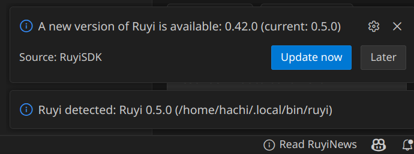
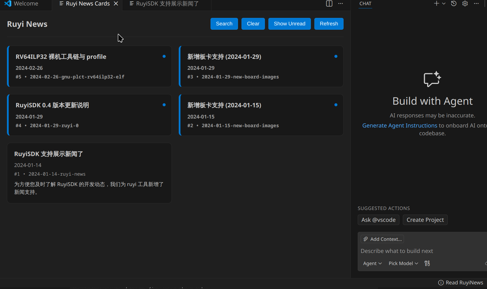
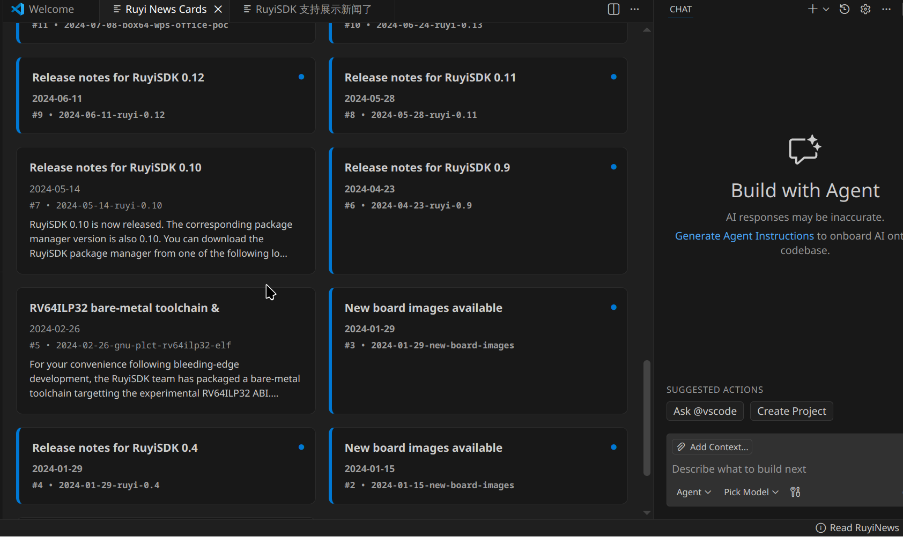
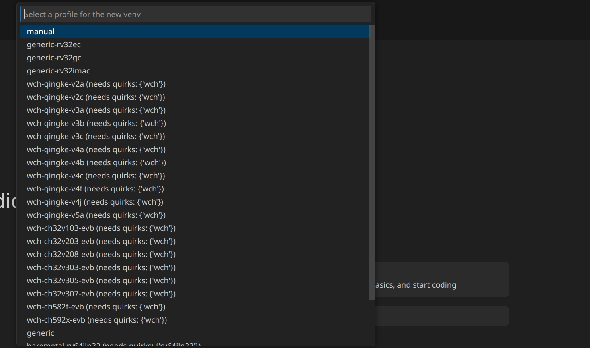
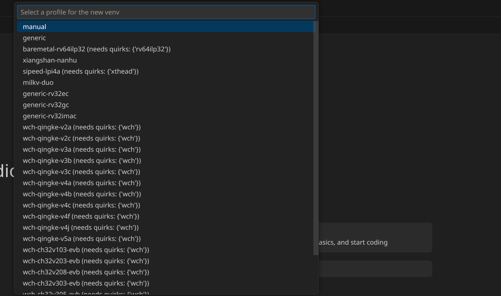
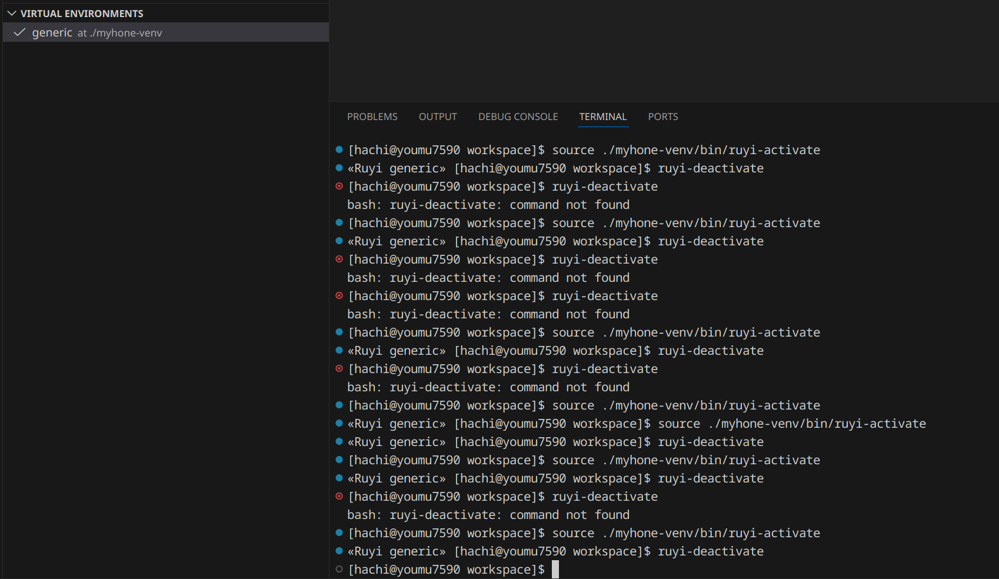
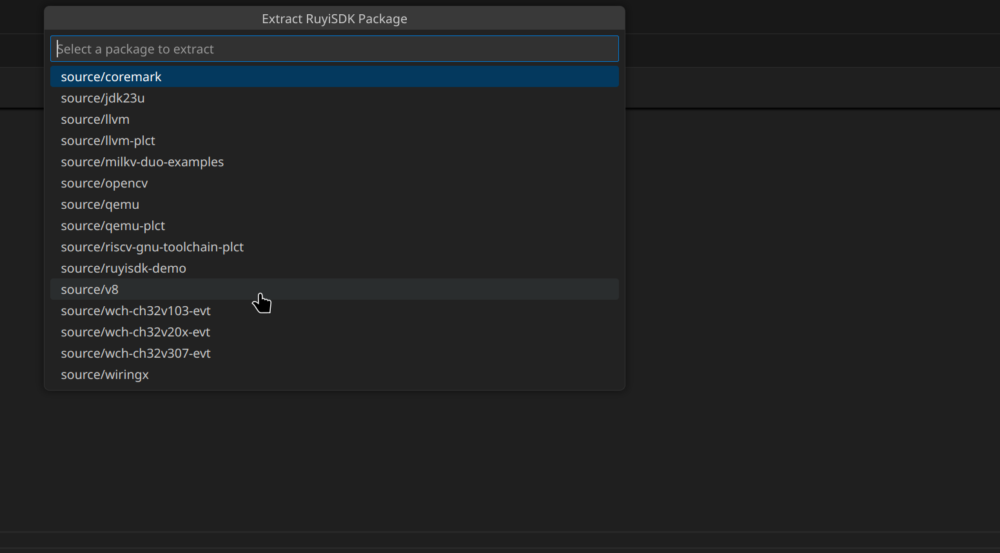
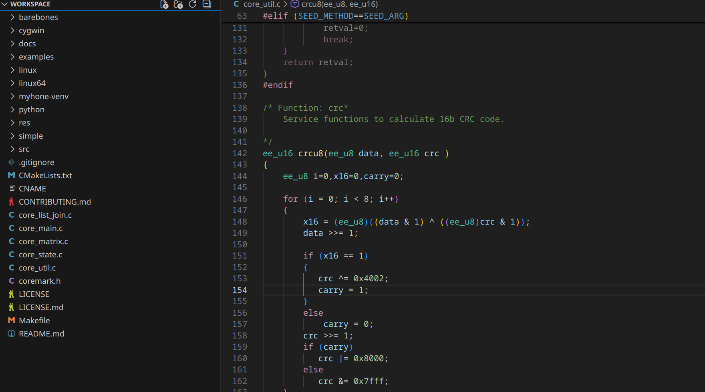

# ruyisdk-vscode-extension f153304 测试

本次测试使用的构建基于 [f153304](https://github.com/ruyisdk/ruyisdk-vscode-extension/tree/f153304ab81c15ce8ea1dc358177e50f804af66a)

测试同时发现一个 ruyi 的 bug，见 [ruyi#409](https://github.com/ruyisdk/ruyi/issues/409)

## 当系统中存在多个 ruyi 版本时，未选中最新版本

本质问题在于缺少多版本共存时的版本管理。

ruyi 提供了多种安装方式， PATH 提供了多个路径，易出现系统中安装有多个 ruyi 命令的情况。需要提供相应配置字段，让用户控制 ruyi 版本检测的功能。

可能同时需要处理 ruyi 配置文件中的 ``installation.externally_managed`` 字段。

```bash
$ whereis ruyi
ruyi: /usr/bin/ruyi /usr/share/ruyi /home/$(whoami)/.local/bin/ruyi

$ /usr/bin/ruyi version
Ruyi 0.42.0

Running on linux/x86_64.
This Ruyi installation is externally managed.

Copyright (C) Institute of Software, Chinese Academy of Sciences (ISCAS).
All rights reserved.
License: Apache-2.0 <https://www.apache.org/licenses/LICENSE-2.0>

$ /home/$(whoami)/.local/bin/ruyi version
Copyright (C) 2023 Institute of Software, Chinese Academy of Sciences (ISCAS).
All rights reserved.
License: Apache-2.0 <https://www.apache.org/licenses/LICENSE-2.0>
```



## 升级 ruyi 失败

用户的 ruyi 可能并不是由这两种方式安装的。而一旦检测到 ruyi 存在，就失去了以这两种方式从头安装 ruyi 的机会。

```bash
$ python3 -m pip install --user -U ruyi
error: externally-managed-environment

× This environment is externally managed
╰─> To install Python packages system-wide, try 'pacman -S
    python-xyz', where xyz is the package you are trying to
    install.
    
    If you wish to install a non-Arch-packaged Python package,
    create a virtual environment using 'python -m venv path/to/venv'.
    Then use path/to/venv/bin/python and path/to/venv/bin/pip.
    
    If you wish to install a non-Arch packaged Python application,
    it may be easiest to use 'pipx install xyz', which will manage a
    virtual environment for you. Make sure you have python-pipx
    installed via pacman.

note: If you believe this is a mistake, please contact your Python installation or OS distribution provider. You can override this, at the risk of breaking your Python installation or OS, by passing --break-system-packages.
hint: See PEP 668 for the detailed specification.

$ python3 -m pipx upgrade ruyi
Package is not installed. Expected to find /home/$(whoami)/.local/share/pipx/venvs/ruyi, but it does not exist.
```

在移除 ``/home/$(whoami)/.local/bin/ruyi`` 后最新版本的 ruyi 被正常检测到，后面的测试均使用 ``/usr/bin/ruyi`` 完成。

## ruyi 新闻页面可以阅读可以刷新但是不能更新

refresh 似乎只是重载了 ruyi 本地 cache，如果本地 cache 过时，则无法在这个页面调用 ``ruyi update`` 实现对最新新闻的拉取。



手动在终端 ruyi update 后再点击 refresh 可以正常载入新内容。

## ruyi 新闻页面优化建议

1. 已读新闻有内容概述，未读新闻没有
2. 已读未读新闻在同一行时，未读新闻卡片有 1/2 留白
3. 重启后丢失全部已读状态



## 虚拟环境 profile 项目排序随机

在点击 + 建立虚拟环境时，列出的 profile 观测到两种随机排序。





## 无法检测到用户手动退出虚拟环境

终端非常自由，用户可以手动进入和退出虚拟环境，可能需要有相关检测。



## 无法选择 extract 的源码包版本

无法选择想要 extract 源码包的版本。



## 无法选择 extract 源码包的目标目录

当前允许将多个包 extract 到工作区，且无法自定义目标目录，可能导致混乱。


